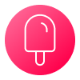

# Pause Reminder

Remember to take a break every now and then!

## Config

Reminders can be configured in `./config/default.json` using cron syntax. You can configure as many reminders as you want.

This is the default: 

```json
{
    "reminders": [
    {
      "cron": "*/20 * * * *",
      "title": "Quick Break",
      "message": "Stand up, stretch your legs and look outside for a minute."
    },
    {
      "cron": "0 */1 * * *",
      "title": "Long Break",
      "message": "Take a longer break, walk around, and hydrate yourself."
    }
  ]
}
```

## Run the app

```bash
pnpm install
node index.js
```

### Known issues

Unfortunately, the icon does not work on modern macOS versions. If you know a fix, please open a PR.

### Credits

Icon made by [UICONS](https://www.uicons.com)
